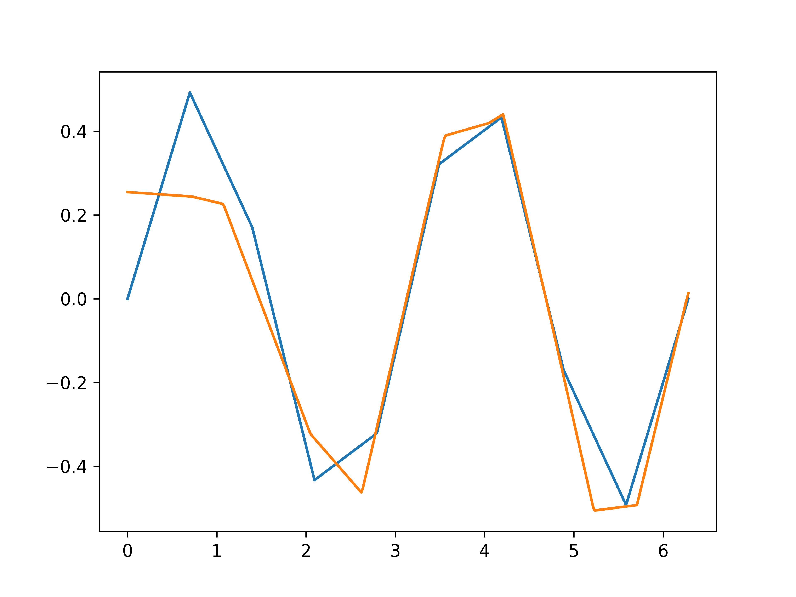
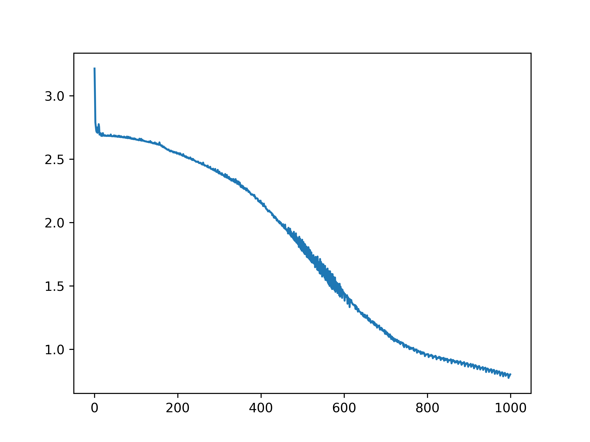
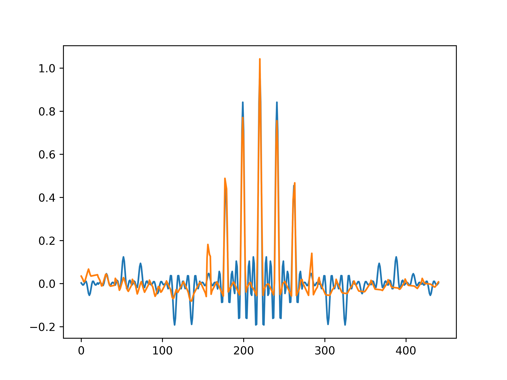
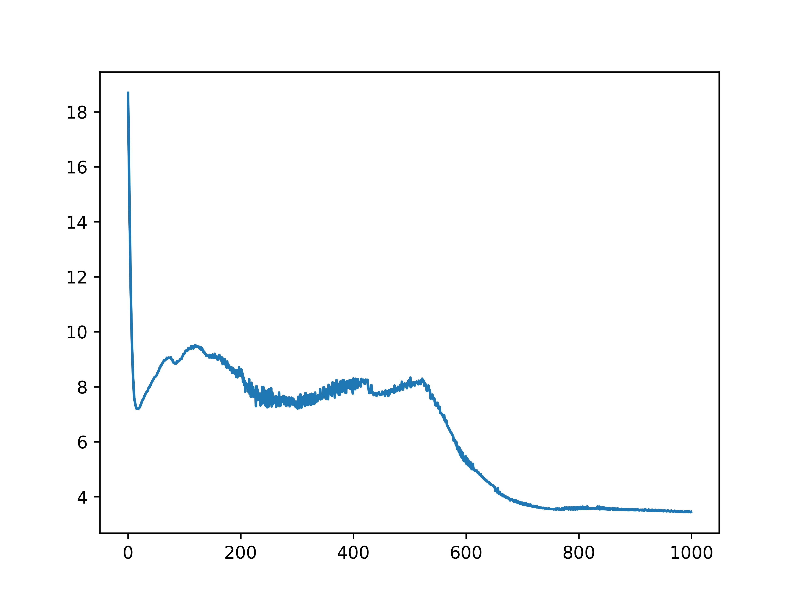

# MLP-BP

A simple implementation of MLP network and BP algorithm in Python.

## Samples

### Sample 1D

f(x) = sin(x) * cos(x), x in [0, 2*pi]

+ 10 training samples, 361 testing samples.
+ 2 hidden layers, each one has 10 units.
+ epochs = 1000, step = 0.05.
  

### Sample 2D

f(x) = (sin(x1) / x1) * (sin(x2) / x2), x in [-10, 10]

+ 11 * 11 training samples, 21 * 21 testing samples.
+ 2 hidden layers, each one has 10 units.
+ epochs = 1000, step = 0.05.

